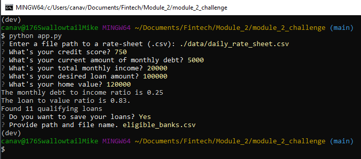

# Project Title

This application collects user data and sorts through available loans.  It allows user to input hteir own informatin, and read from a file containing possible banks and output to a file containing the filtered banks.

---

## Technologies

This is a Python file using the Fire and Questionary libraries.  The documentation for fire and Questionary are provided here:

[Fire](https://google.github.io/python-fire/)

Fire is used to simplify the command line interface.

[Questionary](https://questionary.readthedocs.io/en/stable/index.html)

Questionary is used to simplify user input during command line operation.

The filter functions and read/write csv fucntions are seperated and called from teh files within the filters and utils folders.
---

## Installation Guide

Fire and Questionary must be installed, which can be run with pip as follows:

'''python
pip install fire
pip install questionary
'''

---

## Usage

With the necessary libraries installed, run the app using a python CLI input

'''python
python app.py
'''
Provide the user data that is requested, including a csv file with the daily rates for banks.  When prompted provide a faile path and file name for where the filtered banks should be provided, if desired.

---

## Contributors

Michael Canavan

---

## License

[MIT License](https://choosealicense.com/licenses/mit/)